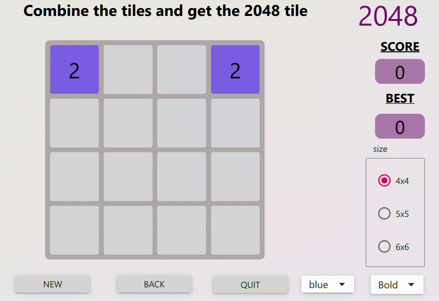

# Game 2048

Implementation of the 2048 game in C++ and QML. The program can be built with Visual Studio.

## Features

- Play the 2048 game with arrow keys or ZQSD keys.
- Animated tile sliding effect for smooth gameplay experience.
- Unlimited undo feature.
- Scoring system.
- Choice of grid size (4x4, 5x5 or 6x6).
- Choice of tile color and style.